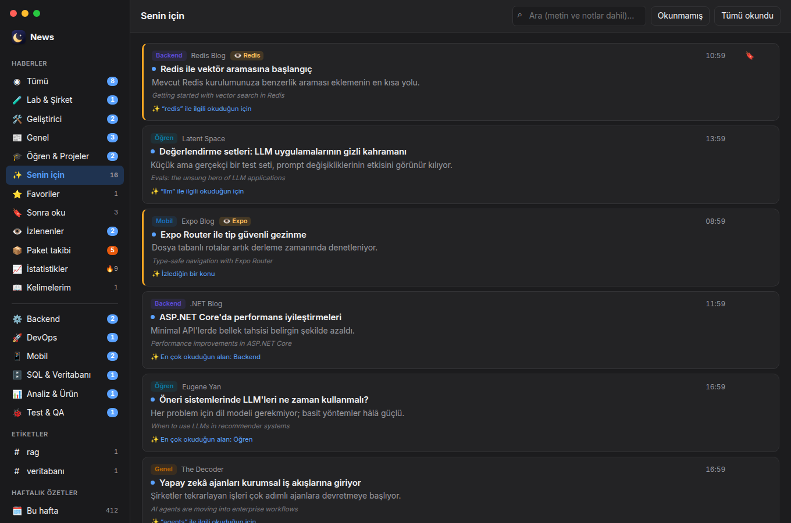
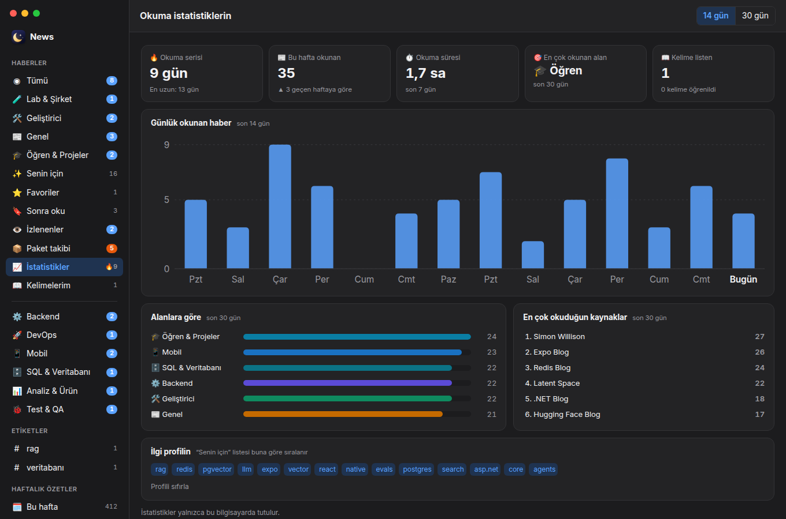

<p align="center">
  
</p>

<h1 align="center">News</h1>

<p align="center">
  <b>Yapay zekâ ve yazılım dünyasından gürültüsüz, kısa ve Türkçe haberler.</b><br>
  Yüzden fazla güvenilir kaynak, tek sakin ekranda — okuyabileceğin, not alabileceğin ve öğrenebileceğin şekilde.
</p>

<p align="center">
  <a href="https://github.com/yunusemre/AI-News/releases/latest"></a>
  
  <a href="LICENSE"></a>
</p>

<p align="center">
  <a href="#kurulum"><b>⬇︎ Kurulum</b></a> · <a href="#özellikler">Özellikler</a> · <a href="#ekran-görüntüleri">Ekran görüntüleri</a>
</p>

<p align="center">
  
</p>

---

Her gün onlarca blog, bülten ve duyuru yayımlanıyor; önemli olanı yakalamak zor. **News**, AI laboratuvarlarından geliştirici bloglarına, .NET'ten React Native'e kadar seçilmiş kaynakları günde üç kez tarar, tekrarları ve reklam kokan içerikleri ayıklar, başlık ve özetleri Türkçeye çevirir ve hepsini tek bir yerde sunar. Haber sitelerinin kalabalığı yok; sadece okumaya değer olanlar.

## Ekran görüntüleri

<table>
  <tr>
    <td width="50%"><br><b>Okuma modu</b> — çift dilli görünüm, vurgular ve notlar</td>
    <td width="50%"><br><b>Kelime sözlüğü</b> — çift tıkla: Türkçesi, okunuşu, tanımı</td>
  </tr>
  <tr>
    <td><br><b>Haftalık özet</b> — son 7 günün öne çıkanları</td>
    <td><br><b>Senin için</b> — okuduklarına göre sıralanır, nedenini söyler</td>
  </tr>
  <tr>
    <td><br><b>Okuma istatistikleri</b> — seri, haftalık okuma, alan dağılımı</td>
    <td><br><b>İlgi alanları</b> — ilk açılışta seç, kenar çubuğu sana göre düzenlensin</td>
  </tr>
</table>

## Özellikler

### 📰 Temiz bir haber akışı
- **İlgi alanlarını seç:** ilk açılışta hangi alanları görmek istediğini seç, kenar çubuğu buna göre düzenlensin.
- **Günde 3 tarama** (09:00, 14:00, 20:00) — yeni haberler uygulama açıkken canlı olarak düşer.
- **Kısa ve öz:** her haberde tek cümlelik açıklama; gürültülü içerikler otomatik elenir.
- **Tekrar yok:** aynı haberi yazan farklı kaynaklar tek kartta birleşir — kartta **"+N kaynak"**, makale sonunda diğer kaynakların bağlantıları.
- **Türkçe ya da orijinal:** başlık, açıklama ve makaleler tercihine göre Türkçe veya orijinal dilde.
- **Bildirimler:** yeni haberler masaüstü bildirimi olarak gelir; istersen sadece takip ettiğin konular için.

### 📖 Uygulama içinde okuma
- **Okuma modu:** reklamsız, sade bir sayfa; tek tıkla Türkçe çeviri.
- **Kaldığın yerden devam:** yarım bıraktığın makale aynı noktadan açılır.
- **Çift dilli görünüm:** orijinal metin, her paragrafın altında Türkçesi.
- **Okuma ayarları:** yazı boyutu, yazı tipi, satır genişliği ve aralığı.
- **Bu konuda diğer kaynaklar:** makalenin sonunda aynı konuyu yazan diğer haberler.
- **Web sayfası görünümü:** istersen sayfanın aslını uygulamadan çıkmadan aç.

### 🗂 Kişisel kütüphane
- **Favoriler** ve **Sonra oku** listesi — dışarıdan bağlantı da ekleyebilirsin.
- **Vurgula ve not al:** metni seç, vurgula ya da not ekle; notlar makalenin yanında durur.
- **Etiketler** ile kendi koleksiyonlarını oluştur, **Markdown** olarak dışa aktar.
- **Tam metin arama:** okuduğun makalelerin içinde ve notlarında ara.

### 🎯 Takip ve öğrenme
- **İzlenen kelimeler:** "Redis", ".NET", "Expo"… geçen haberler vurgulanır ve ayrı listede toplanır.
- **Kelime sözlüğü:** bir kelimeye çift tıkla; Türkçesi, okunuşu, tanımı ve cümledeki anlamı. Kelime listeni kart modunda tekrar et, CSV (Anki / Quizlet) olarak al.
- **Haftalık özet:** son 7 günün öne çıkanları ve her alandan en önemli haberler tek sayfada.

### 🔥 Alışkanlık
- **Senin için:** okuduklarına göre sıralanan kişisel liste — her önerinin yanında neden önerildiği yazar.
- **Okuma istatistikleri:** okuma serisi, haftalık okuma ve süre, alanlara ve kaynaklara göre dağılım.
- **Sabah brifingi:** her sabah tek bildirim (varsayılan 08:30) — gece gelen haberler, izlediğin konular ve öne çıkan başlık; saatini Ayarlar'dan değiştir.

### 🔗 Paylaşım
- macOS paylaşım menüsü (Mail, Mesajlar, AirDrop, Notlar), bağlantı kopyalama ve **Slack / Teams için hazır özet**.

### ⚙️ Kendiliğinden güncel
- Yeni sürümler arka planda indirilir ve kurulur; tek tıkla yeniden başlat.

## Alanlar

| Haberler | Teknoloji |
|---|---|
| 🧪 **Lab & Şirket** — OpenAI, Anthropic, Google DeepMind, Mistral | ⚙️ **Backend** — .NET / ASP.NET Core, Redis, RabbitMQ |
| 🛠️ **Geliştirici** — AI araçları, SDK'lar, geliştirici duyuruları | 🎨 **Frontend** — React, TypeScript, CSS, bültenler |
| 📰 **Genel** — TechCrunch, The Verge, MIT Technology Review, The Decoder | 🚀 **DevOps** — Kubernetes, Docker, HashiCorp, CNCF, GitHub Changelog |
| 🎓 **Öğren & Projeler** — Simon Willison, Latent Space, Karpathy, Import AI | 📱 **Mobil** — React Native, Expo |
| 🌍 **Gündem & Perspektif** — Dünya Halleri, Exponential View, Global İşler | 🗄️ **SQL & Veritabanı** — SQL Server, PostgreSQL |
| | 📊 **Analiz & Ürün** — iş analizi, ürün yönetimi, UX araştırması |
| | 🐞 **Test & QA** — test otomasyonu, Playwright, Cypress, k6 |

"Tümü" akışı yalnızca **Haberler** alanını gösterir; teknoloji alanları kendi listelerinde durur.

## Kurulum

**Gereksinimler:** macOS (Apple Silicon — M1, M2, M3, M4) ya da Windows 10 / 11. Hesap açmak gerekmez.

> 💡 Uygulamayı tarayıcıdan indirirsen imzasız olduğu için işletim sistemi güvenlik uyarısı verir. Aşağıdaki **tek komutla** kurarsan uyarı çıkmaz; güncellemeler de sonra uygulamanın içinden uyarısız gelir.

### 🍎 macOS

1. **Terminal**'i aç: <kbd>⌘</kbd> + <kbd>Boşluk</kbd> → `Terminal` yaz → <kbd>Enter</kbd>
2. Şu satırı yapıştır ve <kbd>Enter</kbd>'a bas:

   ```bash
   curl -fsSL https://raw.githubusercontent.com/yunusemre/AI-News/main/install.sh | bash
   ```
3. Birkaç saniye içinde **News** kurulur (*Uygulamalar* klasörüne) ve açılır.

### 🪟 Windows

1. **PowerShell**'i aç: <kbd>Başlat</kbd> → `PowerShell` yaz → <kbd>Enter</kbd> (yönetici olarak açmana gerek yok)
2. Şu satırı yapıştır ve <kbd>Enter</kbd>'a bas:

   ```powershell
   irm https://raw.githubusercontent.com/yunusemre/AI-News/main/install.ps1 | iex
   ```
3. **News** kurulur, masaüstüne ve Başlat menüsüne kısayolu eklenir ve açılır.

### İlk açılış

- **İlgi alanlarını seç** — kenar çubuğu seçtiklerine göre düzenlenir (sonra *Ayarlar → İlgi alanlarını düzenle*).
- Haberler günde 3 kez (09:00, 14:00, 20:00) kendiliğinden gelir; yeni haberler için bildirim alırsın.
- İstersen *Ayarlar*'dan içerik dilini (**Türkçe / Orijinal**), izlenen kelimeleri ve sabah brifingi saatini ayarla.

### Güncelleme

Yeni sürümler arka planda iner; kenar çubuğunun altında **Güncelle** düğmesi çıkar ya da uygulamadan çıkınca kendiliğinden kurulur. Aynı kurulum komutunu tekrar çalıştırmak da en son sürümü kurar.

### Elle kurulum

Komut satırı kullanmak istemiyorsan son sürümü **[Releases](https://github.com/yunusemre/AI-News/releases/latest)** sayfasından indir:

| Platform | Dosya | Kurulum |
|---|---|---|
| **macOS** (Apple Silicon) | `News-x.y.z-arm64.dmg` | *News*'i **Uygulamalar**'a sürükle. |
| **Windows** 10 / 11 | `News-Setup-x.y.z.exe` | Çalıştır; yönetici izni istemez. |

<details>
<summary><b>"News hasarlı, çöp kutusuna taşıyın" (macOS) ya da "Windows bilgisayarınızı korudu" uyarısı çıkarsa</b></summary>

News henüz Apple / Microsoft tarafından imzalanmadığı için tarayıcıdan indirilen dosyada işletim sistemi uyarı verir. Uygulama zararlı değildir; kaynak kodu bu depoda açıktır.

**macOS**
- *Çöp kutusuna taşıma*, **İptal**'e bas. Sonra Terminal'de:
  ```bash
  xattr -cr /Applications/News.app && open /Applications/News.app
  ```
- ya da **Sistem Ayarları → Gizlilik ve Güvenlik** → aşağıdaki *"News engellendi"* satırında **Yine de Aç**.

**Windows**
- SmartScreen penceresinde **Ek bilgi → Yine de çalıştır**.
- ya da dosyaya sağ tık → **Özellikler** → **Engellemeyi kaldır** → Tamam, sonra çalıştır.

</details>

### Kaldırma

- **macOS:** *Uygulamalar* klasöründen **News**'i çöp kutusuna at. Verilerini de silmek için: `~/Library/Application Support/AI Haberleri`
- **Windows:** *Ayarlar → Uygulamalar → News → Kaldır*. Verilerini de silmek için: `%APPDATA%\AI Haberleri`

## Kısayollar ve ipuçları

| | |
|---|---|
| **Esc** | Okuma ekranından listeye dön |
| **⌘ / Ctrl + tık** | Haberi tarayıcıda aç |
| **Sağ tık** (kartta) | Paylaş menüsü |
| **Çift tık** (makalede) | Sözlük / vurgula / not ekle |
| **⌘ / Ctrl + ↩** | Notu kaydet |
| **Aa** (okuma ekranı) | Yazı boyutu, yazı tipi, genişlik |

## Gizlilik

Hesap yok, takip yok. Favorilerin, notların, etiketlerin, kelime listen ve ayarların **yalnızca kendi bilgisayarında** saklanır. Uygulama haber listesini okur, açtığın makaleyi yükler; çeviri ve sözlük için yalnızca ilgili metni gönderir. Ayrıntılar: [CODE_SIGNING.md](CODE_SIGNING.md#privacy-policy).

## Geliştiriciler için

Electron + React + TypeScript; haberler GitHub Actions ile toplanır ve Firebase üzerinden dağıtılır. Kaynak ve kategoriler `firebase/*.json` dosyalarından yönetilir. Kurulum, yayın ve sorun giderme: **[docs/DEVELOPMENT.md](docs/DEVELOPMENT.md)**.

## Lisans

[MIT](LICENSE) © 2026 Yunus Emre Tatar
