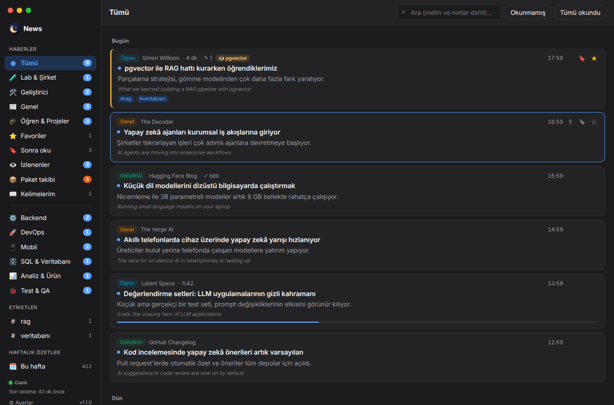
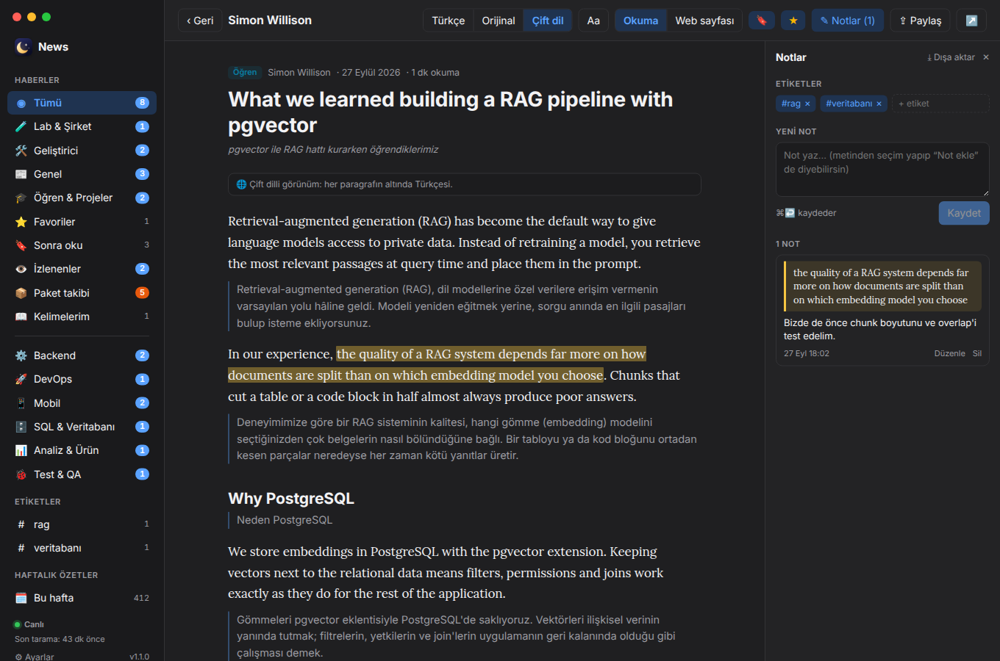
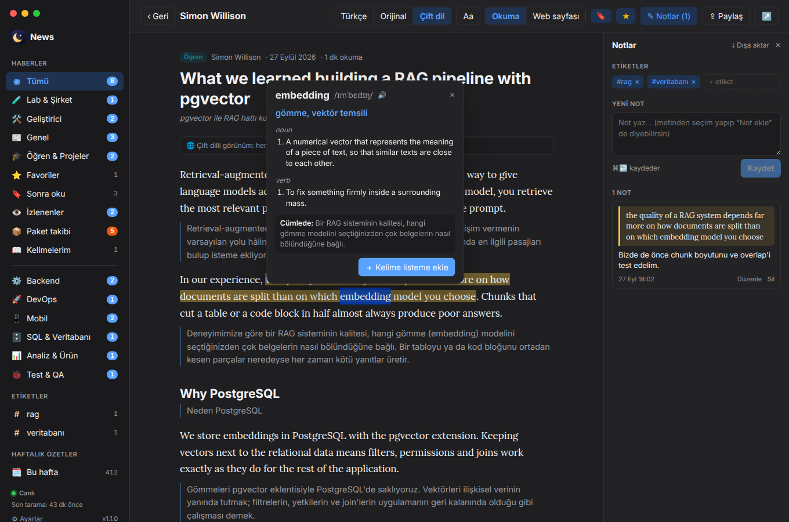
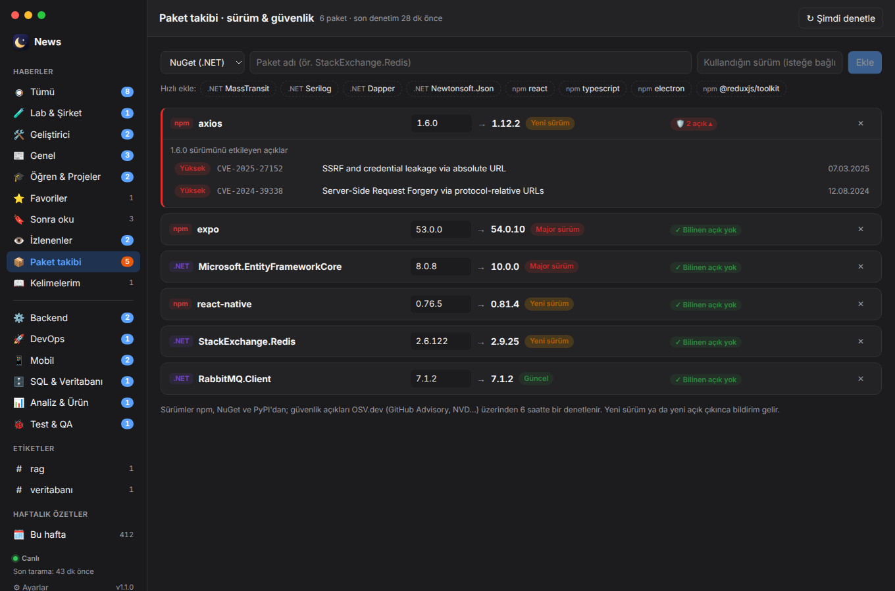
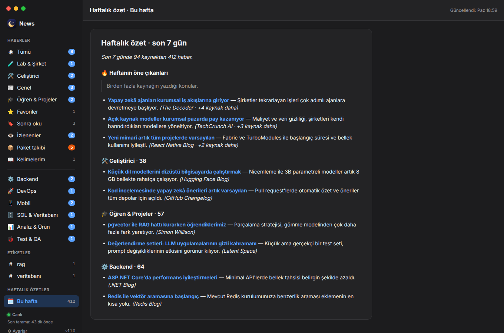
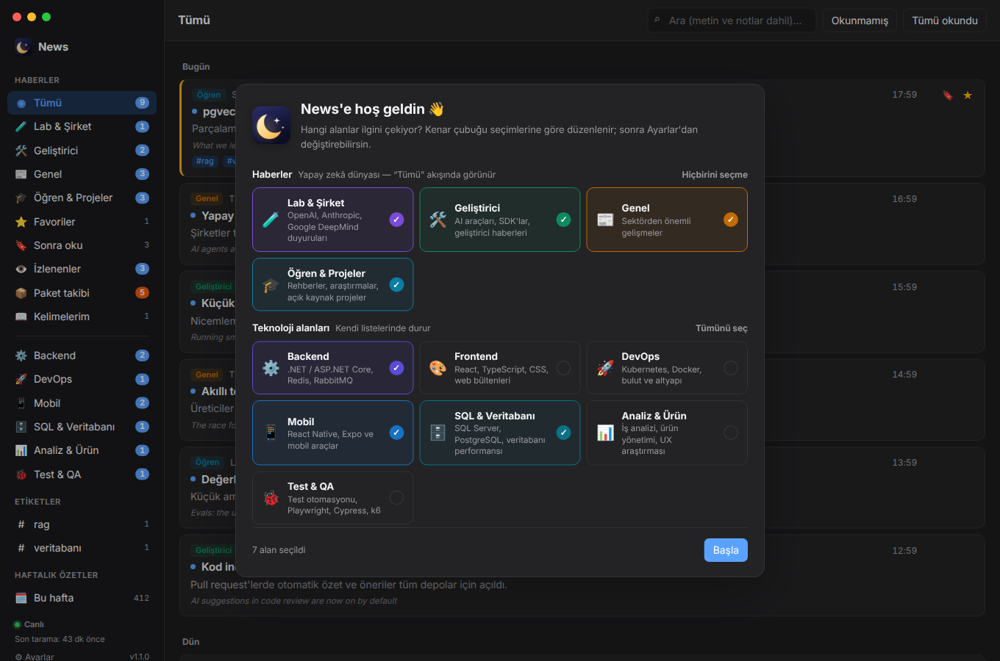

  

<h1 align="center">News</h1>

  <b>Yapay zekâ ve yazılım dünyasından gürültüsüz, kısa ve Türkçe haberler.</b> 
  Yüzden fazla güvenilir kaynak, tek sakin ekranda — okuyabileceğin, not alabileceğin ve öğrenebileceğin şekilde.

  
  
  

  

---

Her gün onlarca blog, bülten ve duyuru yayımlanıyor; önemli olanı yakalamak zor. **News**, AI laboratuvarlarından geliştirici bloglarına, .NET'ten React Native'e kadar seçilmiş kaynakları günde üç kez tarar, tekrarları ve reklam kokan içerikleri ayıklar, başlık ve özetleri Türkçeye çevirir ve hepsini tek bir yerde sunar. Haber sitelerinin kalabalığı yok; sadece okumaya değer olanlar.

## Ekran görüntüleri

<table>
  <tr>
    <td width="50%"> <b>Okuma modu</b> — çift dilli görünüm, vurgular ve notlar</td>
    <td width="50%"> <b>Kelime sözlüğü</b> — çift tıkla: Türkçesi, okunuşu, tanımı</td>
  </tr>
  <tr>
    <td> <b>Paket takibi</b> — yeni sürümler ve güvenlik açıkları</td>
    <td> <b>Haftalık özet</b> — son 7 günün öne çıkanları</td>
  </tr>
  <tr>
    <td colspan="2" align="center"> <b>İlgi alanları</b> — ilk açılışta seç, kenar çubuğu sana göre düzenlensin</td>
  </tr>
</table>

## Özellikler

### 📰 Temiz bir haber akışı
- **İlgi alanlarını seç:** ilk açılışta hangi alanları görmek istediğini seç, kenar çubuğu buna göre düzenlensin.
- **Günde 3 tarama** (09:00, 14:00, 20:00) — yeni haberler uygulama açıkken canlı olarak düşer.
- **Kısa ve öz:** her haberde tek cümlelik açıklama; tekrar eden ve gürültülü içerikler otomatik elenir.
- **Türkçe ya da orijinal:** başlık, açıklama ve makaleler tercihine göre Türkçe veya orijinal dilde.
- **Bildirimler:** yeni haberler masaüstü bildirimi olarak gelir; istersen sadece takip ettiğin konular için.

### 📖 Uygulama içinde okuma
- **Okuma modu:** reklamsız, sade bir sayfa; tek tıkla Türkçe çeviri.
- **Kaldığın yerden devam:** yarım bıraktığın makale aynı noktadan açılır.
- **Çift dilli görünüm:** orijinal metin, her paragrafın altında Türkçesi.
- **Okuma ayarları:** yazı boyutu, yazı tipi, satır genişliği ve aralığı.
- **Bu konuda diğer kaynaklar:** makalenin sonunda aynı konuyu yazan diğer haberler.
- **Web sayfası görünümü:** istersen sayfanın aslını uygulamadan çıkmadan aç.

### 🗂 Kişisel kütüphane
- **Favoriler** ve **Sonra oku** listesi — dışarıdan bağlantı da ekleyebilirsin.
- **Vurgula ve not al:** metni seç, vurgula ya da not ekle; notlar makalenin yanında durur.
- **Etiketler** ile kendi koleksiyonlarını oluştur, **Markdown** olarak dışa aktar.
- **Tam metin arama:** okuduğun makalelerin içinde ve notlarında ara.

### 🎯 Takip ve öğrenme
- **İzlenen kelimeler:** "Redis", ".NET", "Expo"… geçen haberler vurgulanır ve ayrı listede toplanır.
- **Kelime sözlüğü:** bir kelimeye çift tıkla; Türkçesi, okunuşu, tanımı ve cümledeki anlamı. Kelime listeni kart modunda tekrar et, CSV (Anki / Quizlet) olarak al.
- **Haftalık özet:** son 7 günün öne çıkanları ve her alandan en önemli haberler tek sayfada.

### 📦 Paket takibi · sürüm & güvenlik
- Kullandığın **NuGet, npm, PyPI** paketlerini ekle; yeni sürüm (yama / minor / **major**) ve **güvenlik açıkları** (OSV.dev) tek ekranda.
- Sürümünü yazarsan yalnızca **seni etkileyen** açıklar; yeni sürüm ya da açık çıkınca bildirim.

### 🔥 Alışkanlık
- **Senin için:** okuduklarına göre sıralanan kişisel liste — her önerinin yanında neden önerildiği yazar.
- **Okuma istatistikleri:** okuma serisi, haftalık okuma ve süre, alanlara ve kaynaklara göre dağılım.
- **Sabah brifingi:** her sabah tek bildirim — gece gelen haberler, izlediğin konular, paket uyarıları.

### 🔗 Paylaşım
- macOS paylaşım menüsü (Mail, Mesajlar, AirDrop, Notlar), bağlantı kopyalama ve **Slack / Teams için hazır özet**.

### ⚙️ Kendiliğinden güncel
- Yeni sürümler arka planda indirilir ve kurulur; tek tıkla yeniden başlat.

## Alanlar

| Haberler | Teknoloji |
|---|---|
| 🧪 **Lab & Şirket** — OpenAI, Anthropic, Google DeepMind, Mistral | ⚙️ **Backend** — .NET / ASP.NET Core, Redis, RabbitMQ |
| 🛠️ **Geliştirici** — AI araçları, SDK'lar, geliştirici duyuruları | 🎨 **Frontend** — React, TypeScript, CSS, bültenler |
| 📰 **Genel** — TechCrunch, The Verge, MIT Technology Review, The Decoder | 🚀 **DevOps** — Kubernetes, Docker, HashiCorp, CNCF, GitHub Changelog |
| 🎓 **Öğren & Projeler** — Simon Willison, Latent Space, Karpathy, Import AI | 📱 **Mobil** — React Native, Expo |
| | 🗄️ **SQL & Veritabanı** — SQL Server, PostgreSQL |
| | 📊 **Analiz & Ürün** — iş analizi, ürün yönetimi, UX araştırması |
| | 🐞 **Test & QA** — test otomasyonu, Playwright, Cypress, k6 |

"Tümü" akışı yalnızca **Haberler** alanını gösterir; teknoloji alanları kendi listelerinde durur.

## İndir

Son sürüm: **[Releases](https://github.com/yunusemre/AI-News/releases/latest)**

| Platform | Dosya | Kurulum |
|---|---|---|
| **macOS** (Apple Silicon) | `News-x.y.z-arm64.dmg` | Aç, *News*'i **Uygulamalar** klasörüne sürükle. İlk açılışta "geliştirici doğrulanamadı" uyarısı çıkarsa uygulamaya **sağ tık → Aç**. |
| **Windows** 10 / 11 | `News-Setup-x.y.z.exe` | Çalıştır; yönetici izni istemez. SmartScreen uyarısında **Ek bilgi → Yine de çalıştır**. |

Kurulumdan sonra güncellemeler uygulamanın içinden gelir.

## Kısayollar ve ipuçları

| | |
|---|---|
| **Esc** | Okuma ekranından listeye dön |
| **⌘ / Ctrl + tık** | Haberi tarayıcıda aç |
| **Sağ tık** (kartta) | Paylaş menüsü |
| **Çift tık** (makalede) | Sözlük / vurgula / not ekle |
| **⌘ / Ctrl + ↩** | Notu kaydet |

## Gizlilik

Hesap yok, takip yok. Favorilerin, notların, etiketlerin, kelime listen ve ayarların **yalnızca kendi bilgisayarında** saklanır. Uygulama haber listesini okur, açtığın makaleyi yükler; çeviri ve sözlük için yalnızca ilgili metni gönderir. Ayrıntılar: [CODE_SIGNING.md](CODE_SIGNING.md#privacy-policy).

## Geliştiriciler için

Electron + React + TypeScript; haberler GitHub Actions ile toplanır ve Firebase üzerinden dağıtılır. Kaynak ve kategoriler `firebase/*.json` dosyalarından yönetilir. Kurulum, yayın ve sorun giderme: **[docs/DEVELOPMENT.md](docs/DEVELOPMENT.md)**.

## Lisans

[MIT](LICENSE) © 2026 Yunus Emre Tatar
